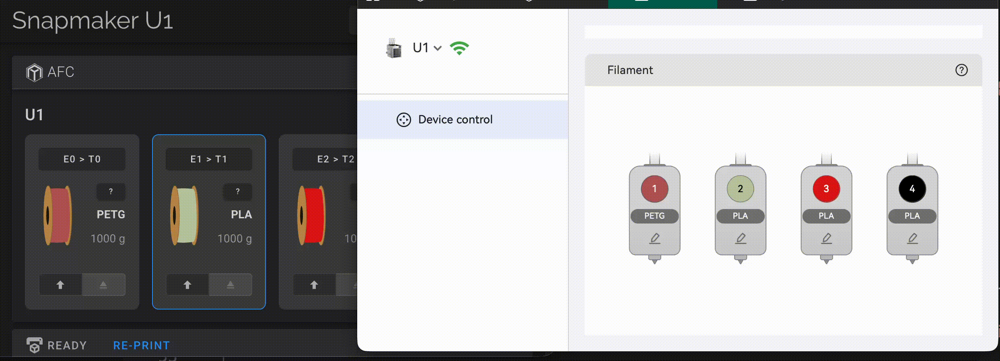
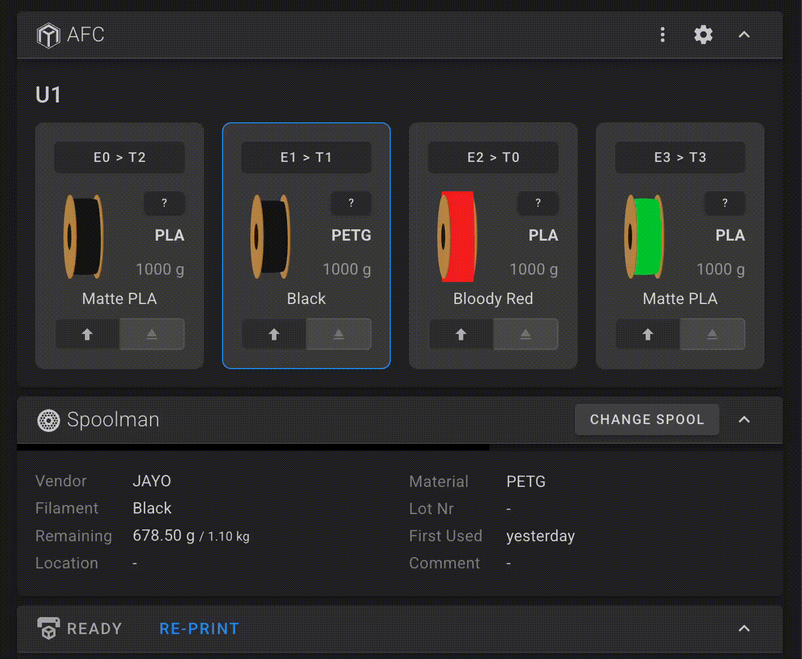

# AFC-Lite Stub Implementation

**EXPERIMENTAL**: This feature is experimental and may be removed at any point without notice.

## Overview

Thin compatibility layer simulating the [ArmoredTurtle AFC-Klipper-Add-On](https://github.com/ArmoredTurtle/AFC-Klipper-Add-On/) to enable AFC UI panels in Fluidd/Mainsail. This is a status reporting stub only and does not implement actual AFC hardware control.

## Why This Exists

To provide an ability to manage U1 extruders via `Fluidd/Mainsail` interface.

## What It Provides

**Status Integration:**

- AFC-compatible status endpoints for Fluidd/Mainsail UI
- Maps U1's 4 extruders to AFC lanes (E0-E3)
- Displays filament information from `print_task_config`

**Macros:**

- `CHANGE_TOOL` - wraps `AUTO_FEEDING`
- `LANE_UNLOAD` - wraps `AUTO_FEEDING UNLOAD=1`
- `SET_COLOR` - wraps `SET_PRINT_FILAMENT_CONFIG`
- `SET_MATERIAL` - wraps `SET_PRINT_FILAMENT_CONFIG`
- `SET_MAP` - wraps `SET_PRINT_EXTRUDER_MAP`

## Limitations

**Not Supported:**

- Spoolman integration (planned for future release)
- Filament tracking and databases
- Runout lane configuration
- Mapping single extruder to multiple logical tools
- AFC hardware (hubs, buffers, physical devices)

**Technical Constraints:**

- None of the AFC.cfg configuration settings apply to AFC-Lite
- Changing (color, material, etc.) the RFID loaded filament via AFC is not supported and will result in error
- Changing weight is not supported, the weight is locked to 1000 g
- Changing runout lane is not supported
- All filament operations use U1's native `AUTO_FEEDING`
- Status reporting only, no actual AFC control

## Enabling/Disabling

Enable via Fluidd/Mainsail settings under **Tweaks > AFC Stub**, or manually:

```bash
ln -sf /usr/local/share/firmware-config/tweaks/klipper/afc.cfg \
       /oem/printer_data/config/extended/klipper/afc.cfg
/etc/init.d/S60klipper restart
```

To disable:

```bash
rm /oem/printer_data/config/extended/klipper/afc.cfg
/etc/init.d/S60klipper restart
```

## Examples

**Snapmaker Orca synchronization:**



**Tools re-mapping:**



