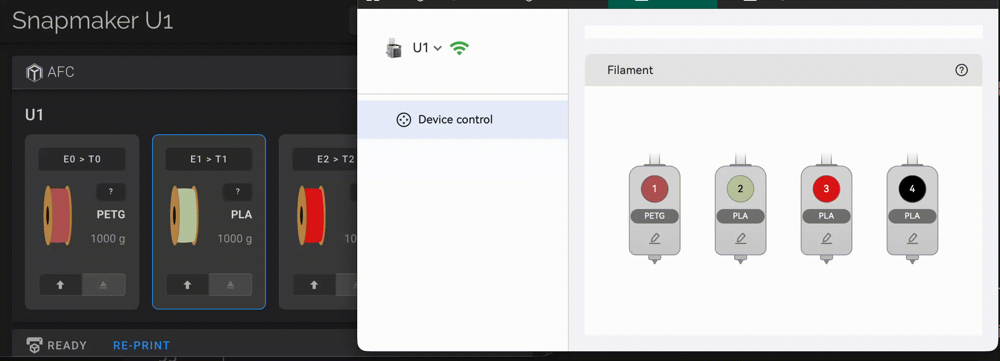
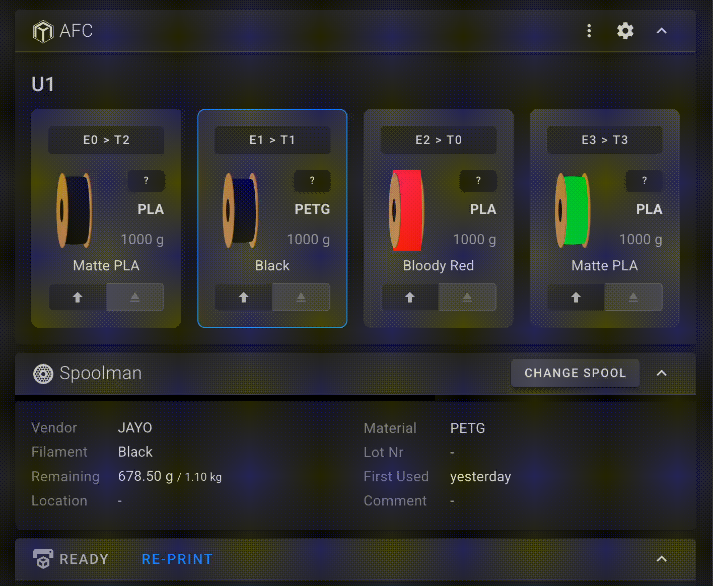

# AFC-Lite Stub Implementation

**EXPERIMENTAL**: This feature is experimental and may be removed at any point without notice.

## Overview

Thin compatibility layer simulating the [ArmoredTurtle AFC-Klipper-Add-On](https://github.com/ArmoredTurtle/AFC-Klipper-Add-On/) to enable AFC UI panels in Fluidd/Mainsail. This is a status reporting stub only and does not implement actual AFC hardware control.

## Why This Exists

To provide an ability to manage U1 extruders via `Fluidd/Mainsail` interface.

## What It Provides

**Status Integration:**

- AFC-compatible status endpoints for Fluidd/Mainsail UI
- Maps U1's 4 extruders to AFC lanes (E0-E3)
- Displays filament information from `print_task_config`

**Spoolman Integration:**

- Automatic spool binding via RFID card detection
- Spool data fetched from Spoolman (material, color, vendor, weight)
- Weight tracking from Spoolman

**Macros:**

- `CHANGE_TOOL` - wraps `AUTO_FEEDING`
- `LANE_UNLOAD` - wraps `AUTO_FEEDING UNLOAD=1`
- `SET_COLOR` - wraps `SET_PRINT_FILAMENT_CONFIG`
- `SET_MATERIAL` - wraps `SET_PRINT_FILAMENT_CONFIG`
- `SET_MAP` - wraps `SET_PRINT_EXTRUDER_MAP`
- `SET_SPOOL_ID` - binds a lane to a Spoolman spool
- `REFRESH_SPOOL` - updates spool weight from Spoolman

## Spoolman Auto-Binding

The AFC-Lite system includes automatic spool detection and binding via RFID cards:

### How It Works

1. **RFID Card Detection**: When an RFID card is detected on a lane, the system reads the card UID
2. **Spool Lookup**: The system queries Spoolman for spools with a matching `lot_nr` field
3. **Auto-Binding**: If a spool is found with `lot_nr=card_uid:XXXX`, the lane is automatically bound to that spool
4. **Card Binding**: If no spool is found, the card UID can be manually bound to a spool using `SET_SPOOL_ID`

### lot_nr Format

The `lot_nr` field in Spoolman supports multiple card UIDs as comma-separated values:

```
card_uid:aabbccdd112233,card_uid:001122334455
```

Each RFID card UID is stored with the prefix `card_uid:` followed by the hex string of the raw UID bytes.

### GCode Commands

**SET_SPOOL_ID**
```
SET_SPOOL_ID LANE=E0 SPOOL_ID=5
```

Binds the specified lane to a Spoolman spool. The RFID card UID is automatically read from the lane's filament_detect system. If a card is present:
- Fetches spool data from Spoolman and applies it to the lane
- Adds the card UID to the spool's `lot_nr` field
- Removes the card UID from any other spools that have it

**REFRESH_SPOOL**
```
REFRESH_SPOOL LANE=E0
```

Updates the cached spool weight from Spoolman for the specified lane.

### Auto-Detection Flow

```
RFID card detected
       |
       v
GET /v1/spool?lot_nr=card_uid:XXXX
       |
       v
If spool found --> Auto-bind lane to spool
       |
       v
Fetch spool data (material, color, vendor, weight)
       |
       v
Update lane filament config
```

### Manual Assignment Flow

```
SET_SPOOL_ID LANE=E0 SPOOL_ID=5
       |
       v
GET /v1/spool/5
       |
       v
Apply spool data to lane
       |
       v
If RFID card present:
  - Add card_uid to spool lot_nr
  - Remove card_uid from other spools
```

## Limitations

**Not Supported:**

- Runout lane configuration
- Mapping single extruder to multiple logical tools
- AFC hardware (hubs, buffers, physical devices)

**Technical Constraints:**

- None of the AFC.cfg configuration settings apply to AFC-Lite
- Changing (color, material, etc.) the RFID loaded filament via AFC is not supported and will result in error
- Changing runout lane is not supported
- All filament operations use U1's native `AUTO_FEEDING`
- Status reporting only, no actual AFC control

## Enabling/Disabling

Enable via Fluidd/Mainsail settings under **Tweaks > AFC Stub**, or manually:

```bash
ln -sf /usr/local/share/firmware-config/tweaks/klipper/afc.cfg \
  /oem/printer_data/config/extended/klipper/afc.cfg
/etc/init.d/S60klipper restart
```

To disable:

```bash
rm /oem/printer_data/config/extended/klipper/afc.cfg
/etc/init.d/S60klipper restart
```

## Examples

**Snapmaker Orca synchronization:**



**Tools re-mapping:**


