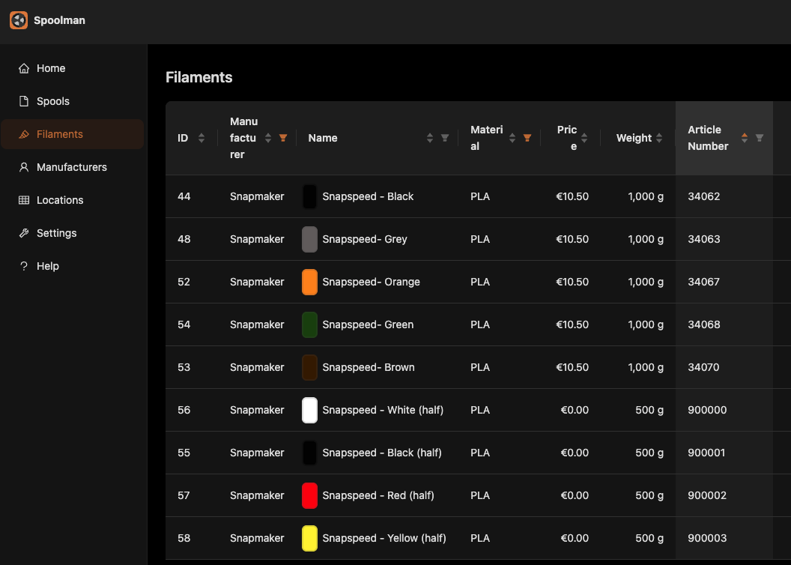

# Spoolman for U1 Multi tool

**Available in: Extended firmware only**

Real time tracking of your material usage

**!!!WARNINIG!!!**

This is not backwards compatible with the manual spoolman config, while the macros may look similar, this integration provides a new Klipper module, and having both config anabled may cause unforeseen behaviours.

## Features

This is like your regular Spoolman for multi tools, with a bit of automation sprinkled in.

- Detects and configures RFID-tagged spools. Untagged spools will still need to have their filament manually selected.
- Set Active spools when a tool is picked.
- Deals with the U1's specific 32 virtual tools system for jobs needing more than 4 filaments.

### What it does not currently do

- It does not write tags, NONE of them.
- It does not automagically figure out `spool_ids`.

## Prerequisites

### A working Spoolman instance

Spoolman is just a web app. You don't need to have it running on your printer, and in this case, you will need to host it somewhere else.
You can find instructions on how to install standalone [Spoolman](https://github.com/Donkie/Spoolman) on its [wiki](https://github.com/Donkie/Spoolman/wiki/Filament-Usage-History).
You can choose 2 different paths:

- [Docker](https://github.com/Donkie/Spoolman/wiki/Installation#docker-install): the easiest in my opinion.
- Or you can go nuts with Python's delirium versions and dependencies and choose a [standalone](https://github.com/Donkie/Spoolman/wiki/Installation#standalone-install) path

### Properly tagged Spools

`Spoolman helper` uses your tags `spool_id` to recognize your spool within your Spoolman instance.
For Snapmaker's spools, since their tags are encrypted, it uses the `SKU` property, and matches is against the `Article Number` filament property in your Spoolman instance.
Note: half kg and 1kg spools of the same color have different SKU.
Here are the SKUs I have. Feel free to add more:

The "SKU trick" can be used with any tag that can be read by your U1 and has such a property.

## Enabling Spoolman

### Connect to your spoolman instance

- Find the `/extended/moonraker/05_spoolman.cfg` file
- uncomment the module configuration section and point it to your spoolman instance.

```
[spoolman]
server: http://10.6.9.248:8000
```

### Enabling the klipper module

- Find the `/extended/klipper/spoolman.cfg` file
- uncomment the macros include and module configuration section

```
[include spoolman_suport_macros/*.cfg]

[spoolman_helper]
mode: auto
logging: info # error, info, warn, verbose, debug

```

### Enabling Spoolman pannel in Fluidd

From Fluidd's main page, open the `3 dots menu`, and select `Adjust dashboard layout`


find the spoolman pannel and verify it is active

!!! PAY ATTENTION !!!: I reorganized my fuidd's pannel as it please me, so your spoolman panel might not be in the same position as mine. Look for it.

### After config

Restart Kipper or the whole printer, of course.

## Module's doc

### Configuration

The `Spoolman Helper` exposes 2 config parameters: mode and logging.

#### mode

`auto` or `manual`, it controls how the `active spool` is selected.

- auto: the rfid is the primary source of truth, if it can find it it'll try to default to a manually configure spool (aka the "normal" way) for the current tool
- manual: the manually configure spool drives, and tags are used as faultback if the user didn't manually select a spool for the selected tool

#### logging

How verbose would you like the logs to be?
From less to more: error, info, warn, verbose, debug

### Macros

The macros provided by this module can be found in `/extended/klipper/spoolman_suport_macros/spoolman_multi_tool.cfg` and they're NOT backwards compatilbe with the old config.

- READ_FILAMENT_ID: makes your printer read the selected lane's {0...3} spool's tag if any
- GET_FILAMENT_ID: print the currently read tag for the selected spool lane
- SET_ACTIVE_SPOOL TOOL={0...3}: sets the selected tool as `Active Spool`
- CLEAR_ACTIVE_SPOOL: clears the current `Active Spool`
- CLEAR_ALL_SPOOLS: clear all the curent selected spool for each tool.
- DUMP_SPOOLS: prints what `Spoolman Helper` knows about the currently loaded spools. This output varies depending on your selected log level.

You will also find 2 other cfg files, they provide the necessary T# macro proxies for the whole spoolman magic to happen:

- `base_tools.cfg`: these are necessary and manadory, without these macros this whole thing does not work.
- `extended_tools.cfg`: these are necessary for `manual` mode, or to provide a fault back spool id for prints needing more than 4 filamens while they're automatically tracked. You most likelly do not need to touch any of this when in `auto` mode.

### Commands

Additionaly `Spoolman Helper` provides the following commands:

- SH_CONFIG, with `MODE` and `LOGS` params, allows you to change the mosumodule's behaviour at runtime without needing to restart klipper or your printer
- SH_DETECT_SPOOLS: tells `Spoolman Helper` to re-detect the loaded spools. This is handy in case of unforseen inconsistent spool states. Kind of like a big reset button for the currently loaded spools
- SH_DEBUG: prints the current `Spoolman Helper` configuration. It takes an optional `SKU` parameter, if proviede it'll try to match it with `Article Number` and it'll print the spool that would be tracked against the proviede sku
